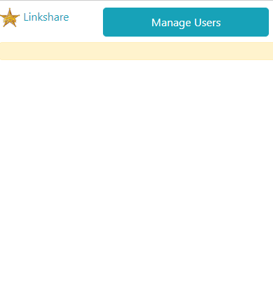
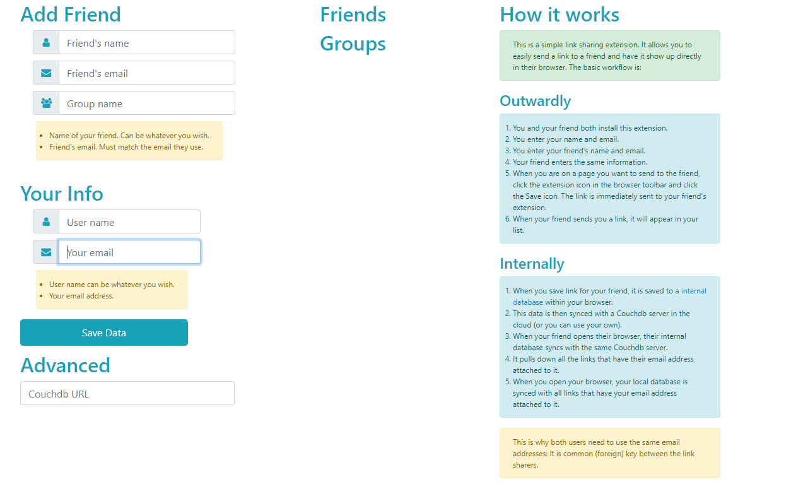

A simple link sharing extension based on https://github.com/glynnbird/linkshare

It allows you to share links between other users of this extension. 

## How it works

We take advantage of the browser IndexedDB. 
1. Install the extension.
1. Open the Manage User page from the extension popup.
1. User 1 enters a user name and email address. This is saved to _local/config.
1. User 2 installs the extension. Provides user name and password.
1. User 1 adds user User 2 to their friend list, using the User 2's email address as the common key. The 'name' is just the text for the button that appears in the popup.
1. User 1 is on page to be shared. Opens the popup and clicks on User 2's name. The link is added to a new record in IndexedDB. User 1 gets a confirmation notice in the popup.
1. The IndexDB is synced with the remote CouchDB instance. 

Then:
1. User 2 opens the browser. 
1. The extention syncs the CouchDB instance and retrives all new records that are keyed with User 2's email address.
    `doc.friendemail == config.useremail`
1. The extension icon shows the number of unvisited links (SUM(visited=0). All links are shown in the popup window. 
1. User 2 clicks a new link. Success!

User 2 can bookmark or whatever. 
When the link is visited, the 'visited' column changes from 0 t0 1. 
Users can delete the link from the list, which removes the document from the DB.
In CouchDB, each friend and each link is a document.
Documents are read and written to the local IndexedDB and synced to CouchDB via PouchDB.

It is assumed that when all is working, I will provide a remote CouchDB instance, stored in a variable in the extension.
There is an option for another CouchDB URL to be set. This allows users to have their own setup.
Testing with localhost works perfectly.

A `group`, when implemented, will simply be a lists of email addresses that will all get the same link.

`_local/config` (configdoc) holds the local users name, email and if set, the alternate CouchDB URL. This document is not synced. (Any record with a `_local` prevfix is not synced.)

For testing, create a 'friend' that uses your same email address. That will allow links you send to the fake friend to show up in your own list. 

### Friend list document

```json
{type: "friend", useremail: "don@dbooth.net", friendname: "Kev", friendemail: "kevinzahm@gmail.com"}
```

### Link document

```json
{type: "link", url: "https://www.cnn.com/", title: "CNN", useremail: "don@dbooth.net", friendemail: "friend@friend.net", visited: 0}
```




